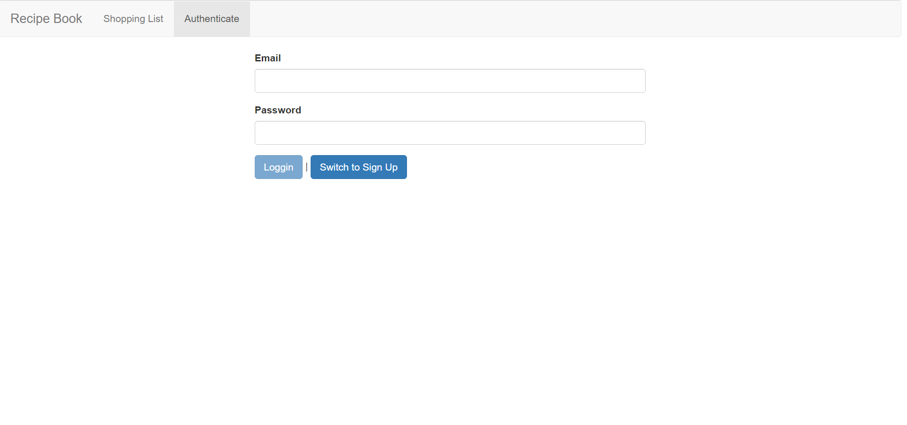
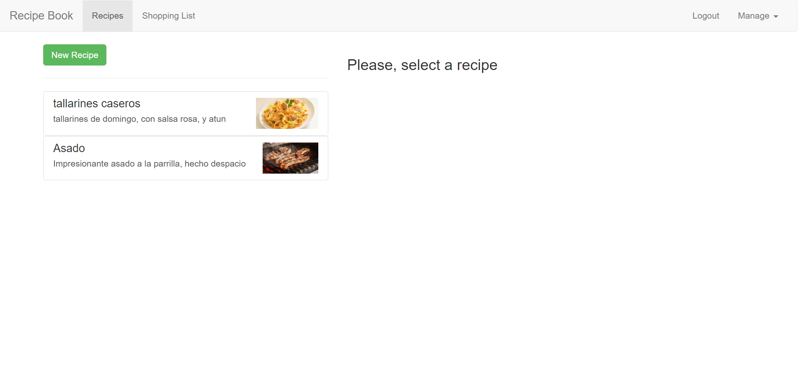
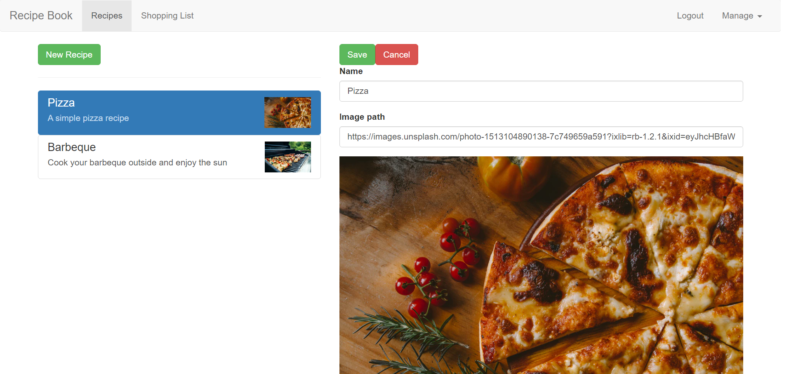
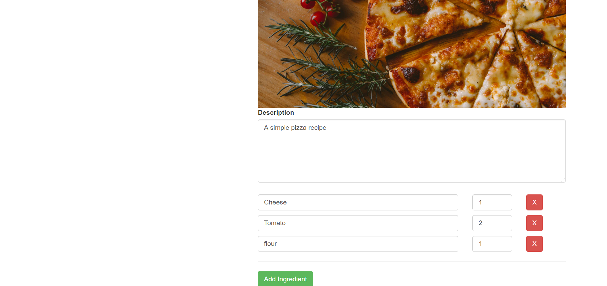
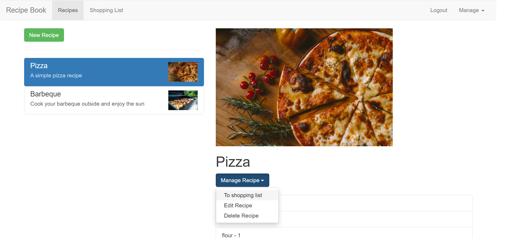
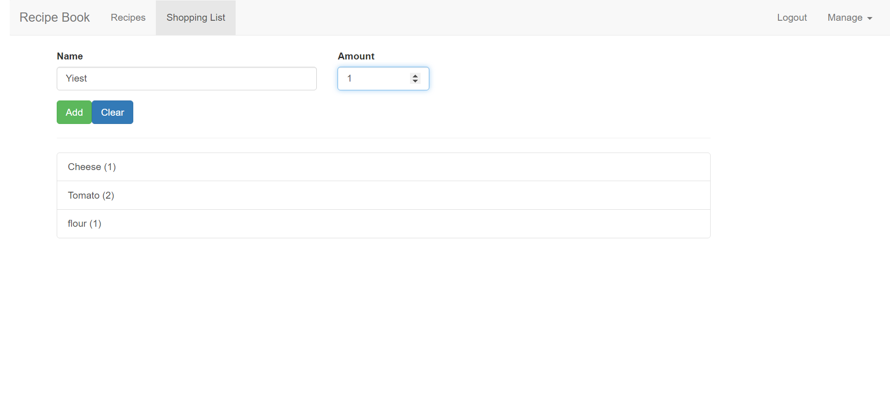

# Recipe-book
> A mobile responsive [Angular](https://angular.io/) app for storing recipes and adding their ingredients to a shopping list. Live app: https://ng-recipe-book-e0f27.web.app/.

## Table of contents

* [General info](#general-info)
* [Screenshots](#screenshots)
* [Technologies](#technologies)
* [Setup](#setup)
* [Features](#features)
* [Status](#status)
* [Inspiration](#inspiration)
* [Contact](#contact)


## General info

This project was coded to learn [Angular](https://angular.io/) from scratch. The state management is done with observables and services, known as facade pattern.


## Screenshots

Image#1: Login




Image#2:  Recipes




Image#3: Edit recipe




Image#4: Edit recipe




Image#5: Manage recipe



Image#5: Shopping List



## Technologies

* [Angular](https://angular.io/) - version 9.1.0
* [Firebase RealTime Database](https://firebase.google.com/docs/database)


## Setup

Clone or download the repo.

Install all the dependencies listed on the`package.json` file by running:

```
npm install
```

#### **Run the Angular app in the development mode.**

In the project directory, you can run:  

```bash
ng serve
```

Open [http://localhost:4200](http://localhost:4200) to view it in the browser.

The page will reload if you make edits.

You will also see any lint errors in the console.

#### Code scaffolding

Run 

```bash
ng generate component component-name
```

to generate a new component. You can also use

```bash
ng generate directive|pipe|service|class|guard|interface|enum|module
```

#### Build

Run 

```bash
ng build 
```

to build the project. The build artifacts will be stored in the `dist/fitness-tracker` directory. Use the `--prod` flag for a production build.

#### Running unit tests

Run 

````
ng test
````

to execute the unit tests via [Karma](https://karma-runner.github.io).

#### Running end-to-end tests

Run 

```
ng e2e
```

to execute the end-to-end tests via [Protractor](http://www.protractortest.org/).

#### Further help

To get more help on the Angular CLI use `ng help` or go check out the [Angular CLI README](https://github.com/angular/angular-cli/blob/master/README.md).


## Features

List of implemented features:
* Authentication
* Form validation
* PUT and GET  requests to a [Firebase RealTime Database](https://firebase.google.com/docs/database).
* Lazy loading
* Nested routes
* Pass data with route parameters

List of possible improvements:

* Automatically GET the data from the database after being logged in, and also automatically  POST and PUT new recipes and changes made to them , without the need of clicking the `fetch` and `save` buttons from the `Manage` dropdown menu.
* Store each user's recipes and shopping list items in a separate collection, because now it's a shared database between all users.

## Status

Project is _finished_. 


## Inspiration

This project was based on this [course](https://www.udemy.com/course/the-complete-guide-to-angular-2/).


## Contact

Created by [Esteban Munch Jones](https://www.linkedin.com/in/estebanmunchjones/)- feel free to contact me.
